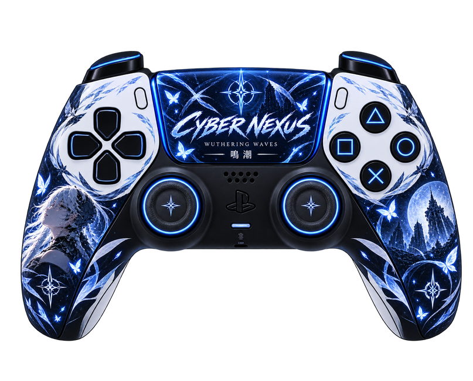

<div align="center">

# 🎮 CYBER NEXUS — CUSTOM GAMEPAD COLLECTION
### GamePad Viewer skins built for the Cyber Nexus stream

Custom PlayStation-style controller overlays for **Wuthering Waves**, **Neverness to Everness (NTE)** and **Mortal Kombat 1**.

Each controller has its own visual identity, assets and calibration while sharing the same goal: **showing controller inputs live on stream without using a generic controller skin.**

</div>

---

## 🎨 Controller Collection

<table>
<tr>
<td width="33%" align="center">
<h3>🌊 Wuthering Waves</h3>

<br><br>
<strong>STATUS: 🛠️ IN DEVELOPMENT</strong><br>
Main Cyber Nexus controller currently being calibrated for GamePad Viewer.
</td>
<td width="33%" align="center">
<h3>🌆 Neverness to Everness</h3>
<br><br>
<strong>NTE CONTROLLER</strong><br><br>
<strong>STATUS: 🎨 ARTWORK PENDING</strong><br>
Dedicated NTE-themed controller and asset pack.
<br><br>
<a href="nte/">Open NTE Project</a>
</td>
<td width="33%" align="center">
<h3>🐉 Mortal Kombat 1</h3>
<br><br>
<strong>MK1 CONTROLLER</strong><br><br>
<strong>STATUS: 🎨 ARTWORK PENDING</strong><br>
Dedicated Mortal Kombat 1 controller for Cyber Nexus MK1 streams.
<br><br>
<a href="mk1/">Open MK1 Project</a>
</td>
</tr>
</table>

---

## ⚡ Purpose

This repository is the home of the **Cyber Nexus custom controller overlay collection**. The project replaces the standard GamePad Viewer appearance with game-specific designs while preserving live controller input feedback.

The overlays are intended for livestreams and gameplay recordings using **OBS Studio**, browser sources and other compatible streaming software.

Each skin is developed independently so its artwork and input positions can be changed without affecting the other games.

## 🗂️ Project Layout

```text
cyber-nexus-wuwa-gamepad/
│
├── cyber-nexus-wuwa-gamepad.css     # 🌊 Wuthering Waves official CSS
├── assets/                           # 🌊 Wuthering Waves assets
│   ├── base.png
│   ├── dpad.png
│   ├── sticks.png
│   ├── face-buttons.png
│   ├── menu-buttons.png
│   ├── bumpers.png
│   └── triggers.png
│
├── nte/                              # 🌆 Neverness to Everness
│   ├── README.md
│   ├── nte-gamepad.css               # planned
│   └── assets/                       # NTE-only artwork
│
└── mk1/                              # 🐉 Mortal Kombat 1
    ├── README.md
    ├── mk1-gamepad.css               # planned
    └── assets/                       # MK1-only artwork
```

## 🎮 Input System

Each finished controller is intended to support real-time feedback for:

**D-pad • Analog sticks • △ ○ × □ • Create/Options • L1/R1 • L2/R2 • Stick clicks**

The Wuthering Waves controller currently uses the **PS4 White / DS4 layout (`s=8`)** from GamePad Viewer with custom CSS loaded through `editcss` and hosted through GitHub Pages.

## 🚧 Development Roadmap

### 🌊 Wuthering Waves
**Current:** controller base established → D-pad calibration → analog sticks → face buttons → shoulder buttons/triggers.

### 🌆 NTE
**Next:** create the NTE controller artwork → split interactive assets → create dedicated CSS → calibrate GPV inputs.

### 🐉 Mortal Kombat 1
**Next:** create the MK1 controller artwork → split interactive assets → create dedicated CSS → calibrate GPV inputs.

---

<div align="center">

## ⚡ CYBER NEXUS

**Wuthering Waves 🌊 • NTE 🌆 • Mortal Kombat 1 🐉**

Custom controller overlays built for the **Cyber Nexus** streaming community.

</div>
