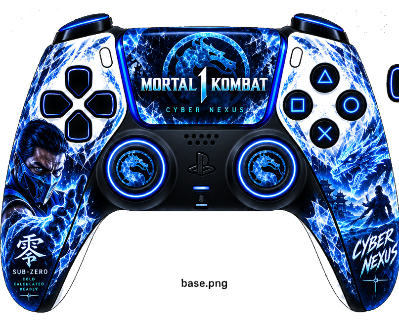

# ❄️ Control Cyber Nexus × Mortal Kombat 1 — Sub-Zero

Esta carpeta contiene el skin dedicado de **Mortal Kombat 1 (MK1)** para GamePad Viewer, creado para los streams de Cyber Nexus y basado en **Sub-Zero**.

  

## Recursos

Todo el diseño específico de Mortal Kombat 1 se encuentra dentro de `mk1/assets/` y se mantiene completamente separado de los skins de Wuthering Waves y Neverness to Everness.

Archivos:

- `base.png`
- `dpad.png`
- `sticks.png`
- `face-buttons.png`
- `menu-buttons.png`
- `bumpers.png`
- `triggers.png`

La hoja de estilos oficial es `mk1-gamepad.css`.

## 🎮 GamePad Viewer

Este control utiliza el diseño **PS4 White / DS4 (`s=8`)** de GamePad Viewer y carga el skin de Cyber Nexus mediante CSS personalizado alojado en GitHub Pages.

Orden actual de desarrollo:

**Base del control → calibración del D-pad → sticks analógicos → botones principales → Create/Options → L1/R1 → L2/R2 → clics de los sticks**

> 🛠️ **ESTADO: EN DESARROLLO** — El control principal de Cyber Nexus está siendo calibrado actualmente para GamePad Viewer.
