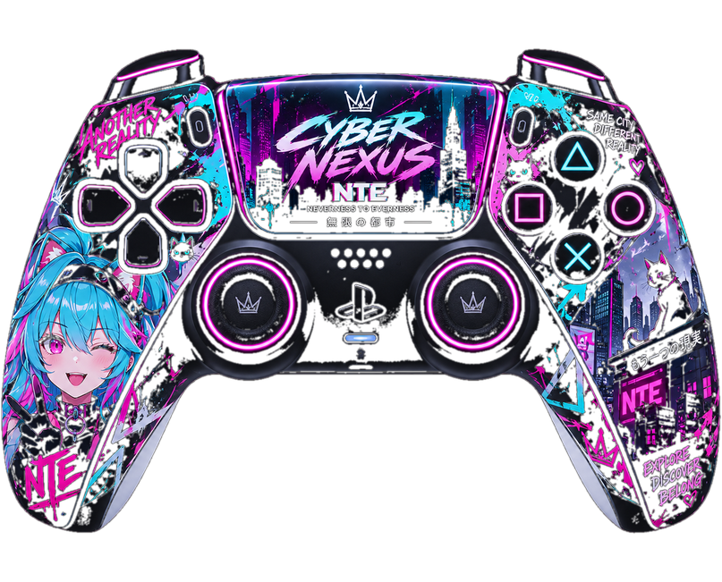

# 🌆 Cyber Nexus × Neverness to Everness Controller

This folder contains the dedicated **Neverness to Everness (NTE)** GamePad Viewer skin for the Cyber Nexus stream.

  

## Assets

All NTE-specific artwork lives inside `nte/assets/` and is kept completely separate from the Wuthering Waves and Mortal Kombat 1 skins.

Files:

- `base.png`
- `dpad.png`
- `sticks.png`
- `face-buttons.png`
- `menu-buttons.png`
- `bumpers.png`
- `triggers.png`

The official stylesheet is `nte-gamepad.css`.

## 🎮 GamePad Viewer

This controller uses the **PS4 White / DS4 layout (`s=8`)** from GamePad Viewer and loads the Cyber Nexus skin through custom CSS hosted with GitHub Pages.

Current development order:

**Controller base → D-pad calibration → analog sticks → face buttons → Create/Options → L1/R1 → L2/R2 → stick clicks**

> 🛠️ Controller artwork is installed and live input calibration is currently in development.
